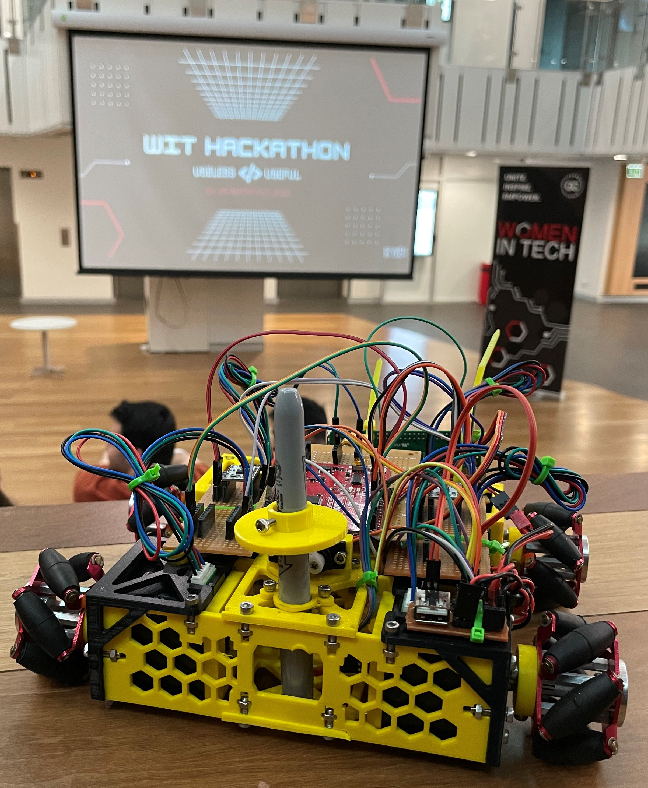
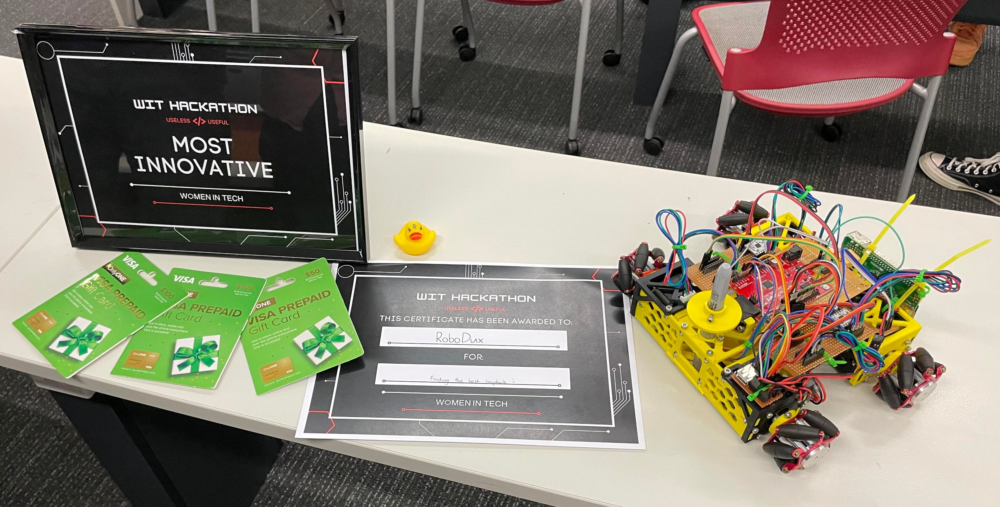

# RoboDux-Hackathon
Our submission for the 2022 WIT Hackathon :)

## Project
The project is a mecanum wheeled robot that using a gravity assited pen dropper would create drawings on the ground. The drawings will come from a public website where anyone could draw on an online canvas and the robot would attempt to replicate this. The project is not finished due to working on it only for the two days of the hackerthon but there are plans to complete it during university holidays.

## Team Members
 - Web Backend and Steppers: Devin Da Silva Martins
 - Web Frontend: Wenze Wang
 - Mechanical System: Phoenix Seybold
 - Electrical System and Drive Control: Ryan Malone
 - Steppers and Presentation: Tashi Visschedijk

## Awards
 - Most Innovative
 - Finding the Best Loop Hole

